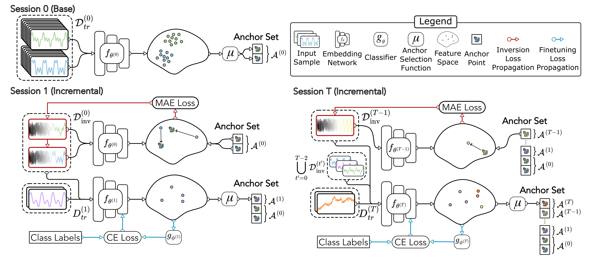

# AnchorInv: Few-Shot Class-Incremental Learning of Physiological Signals via Feature Space-Guided Inversion

# Environment
Create conda environment

`conda env create -f environment.yml`

Activate environment

`conda activate anchorinv`

# Preprocessing
Download NHIE dataset

Preprocess and save as `.npy`

`python nhiedataset_preprocessing_traintest_psz.py > "/data/quee4692/NHIEdataset/NHIEdataset_bipolar_filtered_64hz_60s_p5overlap_psz_tt_dataloader/dataset_summary.txt"`

Select and save the support samples

`python nhiedataset_preprocessing_traintest_supportselect.py`

# Code
Base session training and incremental adaptation using `run.sh`
